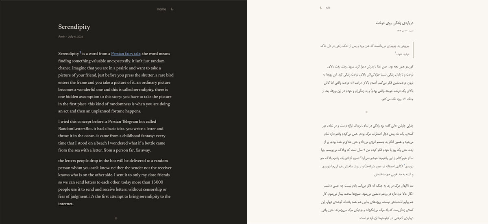

# Waldi

A quiet place to write, and to be read.

Live at **[waldi.blog](https://waldi.blog)** — reading is open to everyone; writing is by invitation while the founding writers shape the place.



Waldi is a multi-tenant blogging platform for people who miss blogs — one Go binary and Postgres, server-rendered `html/template` pages, and a single Tiptap editor island. Every writer gets `username.<base-domain>` (or a domain of their own); the same binary serves every blog by reading the request's `Host` header at runtime, so there's no per-tenant deployment to manage.

The loop it's built around: publish, a hundred strangers read it, and a follow or a private letter comes back. No public like counts, no comments, no leaderboards. Replies are private letters, and every post gets a guaranteed floor of readers before any algorithm judges it — so a new writer never publishes into silence.

## Why

I started my own blog, dissolve, in 2016 — late to a party that was already ending. The Persian blogosphere had been one of the largest and most alive corners of the early web; it's where I found some of my closest friends. Then the platforms it lived on decayed or died, sometimes taking a decade of people's writing with them, and everyone scattered to Telegram, Instagram, and Twitter — places that never gave writing back its private, unhurried room.

Waldi is my answer to that history, built on two convictions. First, that the reason blogs died wasn't the writing — it was distribution: a new blog published into silence while social feeds guaranteed an audience for noise. So Waldi guarantees the audience instead: every post is read by strangers before any judgment of it exists. Second, that the reader's day should be finishable — a handful of posts from writers you follow, one surprise from a stranger, and then: that's everything for today.

It launched Persian-first, because that's the blogosphere I owe it to — but it's bilingual by construction (see [Multi-language / i18n](#multi-language--i18n)), and English is a first-class citizen, not a translation target.

The product's rules — letters instead of comments, no public metrics anywhere, a hard list of features that will never be built — are documented in [ROADMAP.md](ROADMAP.md) and [docs/DESIGN.md](docs/DESIGN.md).

## Architecture

### Request flow / multi-tenancy

Every request goes through `internal/web/server.go: ServeHTTP`, which first checks whether the `Host` header maps to a blog (`internal/web/host.go: isBlogHost`):

1. Cheap subdomain match: `username.<base-domain>` (or `.localhost` / `.waldi.test` in dev) — `BlogFromHost`.
2. Otherwise, a verified custom domain lookup against Postgres, cached in-process (`customDomainCache`, positive/negative TTLs) to avoid a DB hit per request.

Handlers branch on whether the resolved host is a blog vs. the main app domain (`internal/web/blog.go`, `handlers_read.go`). Session cookies are scoped with `cookieDomain` so login on the main domain carries over to `username.<base-domain>` subdomains, but not to custom domains.

### Layering

- `internal/web` — HTTP layer: routing (`server.go`), handlers (`handlers_*.go`, one file per feature area), template data structs and rendering (`render.go`), session/locale/host resolution.
- `internal/store` — all SQL, wrapping a `*pgxpool.Pool` (`store.go`). One file per entity (`users.go`, `posts.go`, `follows.go`, `letters.go`, `events.go`, `invitations.go`, `settings.go`, `stats.go`). Handlers call store methods directly — no repository/service interface layer.
- `internal/post` — pure domain logic for the Tiptap document model: JSON schema validation, sanitized HTML rendering, image URL fixups, embeds, footnotes. No DB or HTTP — the most heavily unit-tested package.
- `internal/jobs` — daily background jobs (digest emails, wildcard selection), invoked as CLI subcommands, not a queue/worker process.
- `internal/mail` — SMTP sending behind a small `Mailer` interface; `NoopMailer` when SMTP isn't configured (dev).
- `internal/storage` — image upload storage: local disk or S3-compatible (Cloudflare R2 in production), with resize-to-WebP on upload.
- `internal/cdn` — Cloudflare cache purge on publish (optional; needs a zone ID/token).
- `internal/i18n` — translation catalog, used from Go and from templates.
- `internal/telegrambot` — the admin bot (see below).
- `internal/importcommon` — shared HTML-to-document conversion used by every importer.
- `internal/importblogir` — the blog.ir importer; the reference implementation for adding support for another platform (see `CONTRIBUTING.md`).
- `internal/migrate` — runs numbered, append-only SQL files from `migrations/`.
- `cmd/waldi` — CLI entrypoint; subcommands dispatched in `main.go` (`serve`, `migrate`, `digest`, `reader-digest`, `wildcard`, `weekly-stats`, `invite`, `user`, `import`, `posts`).

### Frontend

- `web/templates/*.html` — server-rendered pages, loaded via `template.ParseFS` (disk in dev, `embed.FS` for deploys). Data is a single `web.PageData` struct with one optional sub-view per page type.
- `web/static/css/main.css` — hand-written, no framework.
- `web/editor/` — the Tiptap island (TypeScript), bundled by esbuild straight to `web/static/js/editor.js`.
- The editor's document schema is enforced server-side in `internal/post/doc.go` — the server, not the client, is what stops writers from producing invalid documents.

### Data model

Postgres, `migrations/00N_*.sql`. Core tables: `users`, `sessions`, `posts` (`doc` jsonb is the Tiptap source of truth, `html` is pre-rendered/sanitized at publish time and served as-is), `follows` (with `source_post_id` for follow-attribution), `letters`, `impressions`/`readings` (append-heavy event logging), `wildcards`, `digests`, plus custom domains, invitations, and admin settings.

## Infrastructure

| Concern | What's used |
|---|---|
| Database | PostgreSQL |
| Object storage | Cloudflare R2 (S3-compatible; any S3-compatible store works) — images are resized and converted to WebP on upload |
| Edge cache | Cloudflare — anonymous HTML pages are served `Cache-Control: public`, cached at the edge, and purged on publish/settings/domain changes via the Cloudflare API |
| TLS + custom domains | Caddy — wildcard cert via Cloudflare DNS challenge for `*.<base-domain>`, on-demand per-domain Let's Encrypt certs for verified user custom domains (gated by an internal `/internal/caddy-ask` endpoint) |
| Email | Any SMTP provider — separate From addresses for transactional (verification, password reset) and bulk digest email |
| Deploy | Docker Compose on a single VM (reference target: a DigitalOcean Droplet). A managed-platform deploy (e.g. Heroku) is on the roadmap but not yet supported, since the app currently owns its own TLS/Caddy layer |
| CI/CD | GitHub Actions — lint → test → build on every push/PR, then deploy over SSH on merge to `main` |
| Backups | Daily cron dumps Postgres and uploads the gzip'd archive to R2 |
| Admin | A Telegram bot (see below) instead of a web admin panel |

See `DEPLOY.md` for the full production setup.

## Self-hosting

Yes, you can run your own — the license is MIT and `DEPLOY.md` documents the full production setup, including the parts that assume Cloudflare/R2/Caddy and how to substitute them. Two honest caveats: **waldi.blog is the canonical community** and the only instance I operate or support, so self-hosted instances are their own quiet islands — the guaranteed-readers loop is only as real as the readers your instance has. And the roadmap follows the needs of waldi.blog first; issues from self-hosters are welcome, but fixes for hosted-only concerns come first.

## Multi-language / i18n

Translation strings live in flat JSON catalogs, embedded into the binary (`internal/i18n/locales/en.json`, `fa.json`). Every user-facing string is looked up via `T(lang, key, args...)` (`internal/i18n/catalog.go`) and templates are **shared across languages** — there's no per-language template duplication, every string in `web/templates/*.html` routes through `PageData.T`.

Per-request language resolution priority: logged-in user's stored locale → `locale` cookie → `CF-IPCountry` header (via `i18n.LangFromCountry`) → default (`fa`). Users can change their language from account settings, which updates the cookie, persists to their account, and purges the cached page.

**To add a new language:**

1. Add `internal/i18n/locales/<code>.json`, mirroring every key from `en.json`.
2. Add `"<code>": true` to `supported` in `internal/i18n/catalog.go`.
3. If the language reads right-to-left, add a case to `Dir()` in the same file (defaults to LTR).
4. Optionally extend `i18n.LangFromCountry` (`internal/i18n/country.go`) so visitors from that country get it automatically.

No template changes are needed — the catalog is the only thing that grows.

## Background jobs / cron

Three scheduled jobs, all in `internal/jobs/`, run as CLI subcommands on a host crontab (not a queue):

```cron
0 3 * * *  ./deploy/backup-db.sh      # daily Postgres backup -> R2
0 6 * * *  waldi wildcard             # pick today's wildcard post per reader
10 6 * * * waldi reader-digest        # reader + anonymous reader digest (reads the wildcard assignment above)
0 7 * * *  waldi digest               # writer digest
0 21 * * 5 waldi weekly-stats         # growth summary, pushed to Telegram admins
```

- **Writer digest** (`digest.go`) — per-post activity from the last 24h (readers, completions, follows, letters), emailed to writers each morning.
- **Reader digest** (`reader_digest.go`, `ReaderDigestJob`) — for verified, subscribed accounts: new posts from followed writers in the last 24h, plus that day's assigned wildcard post.
- **Non-authenticated reader digest** (same file, `runForCapturedEmails`) — the same digest shape for people who left their email via the inline capture form on a public post page but never created an account, keyed by a per-address unsubscribe token instead of a session.

### Wildcard selection

Every reader gets one "wildcard" post a day — a stranger's post, guaranteed impressions floor, no algorithm-as-black-box. Selection (`internal/jobs/wildcard.go`, `internal/store/posts.go`) currently works in two tiers:

1. **Admin-curated pool** — posts an admin has explicitly added via the Telegram bot are preferred.
2. **Fallback heuristic** — a deterministic SQL query over published, non-test, ≥50-word posts in the reader's language, excluding the reader's own posts, already-followed authors, and previously-assigned posts. It prioritizes posts still under the impression floor (default 100), oldest first, then falls back to newest.

This is intentionally simple today. **Planned** (see `ROADMAP.md`): a formal scoring system — `0.6 × follow-rate + 0.3 × completion-rate + 0.1 × letter-rate`, Wilson-adjusted for small sample sizes — with staged exposure pools (100 → 500 → 2000 impressions) that a post graduates through as it proves itself, replacing manual pool curation as volume grows.

## Telegram admin bot

There's no web admin panel — moderation and support run through a Telegram bot (`internal/telegrambot`) restricted to a configured list of admin Telegram user IDs. It runs alongside `waldi serve` when `WALDI_TELEGRAM_BOT_TOKEN` and `WALDI_TELEGRAM_ADMIN_IDS` are set.

Commands: `/users`, `/posts` (with an inline "add to wildcard pool" button), `/pool` (view/remove today's wildcard pool), `/verify`, `/setusername`, `/setemail`, `/delete`, `/invite`, `/wildcardfloor` (get/set the impression floor). Wildcard control today is indirect — curating the eligible pool and adjusting the floor — matching the current heuristic; the planned scoring system (above) is meant to take over most of this by formula rather than admin judgment.

## Quickstart

```bash
cp .env.example .env
make db        # start Postgres (+ MinIO) via docker compose for local dev
make migrate   # run migrations
make dev       # air (Go live reload) + esbuild --watch for the editor, in parallel
```

Local subdomains: `http://localhost:8080` (app) and `http://USERNAME.localhost:8080` (a blog). Use `waldi.test` (with `/etc/hosts` entries) instead of `localhost` when testing cross-subdomain cookie behavior, since production cookies are scoped to `.baseDomain`.

## Commands

```
make db        # start Postgres (+ MinIO) via docker compose for local dev
make migrate   # run migrations (go run ./cmd/waldi migrate)
make dev       # air (Go live reload) + esbuild --watch for the editor, in parallel
make build     # build the editor bundle, then go build ./cmd/waldi
make test      # go test ./...
make lint      # golangci-lint run
make fmt       # gofmt -w cmd internal
```

- Single test: `go test ./internal/post/... -run TestName -v`
- Single package: `go test ./internal/store/...`
- Editor JS only: `cd web/editor && npm run build` (or `npm run watch`)

## Contributing

See `CONTRIBUTING.md`. Day-to-day work happens on `develop`; `main` tracks production.

## Roadmap

See `ROADMAP.md` for what's shipped, in progress, planned, and deliberately never built.

## License

MIT — see `LICENSE`.
